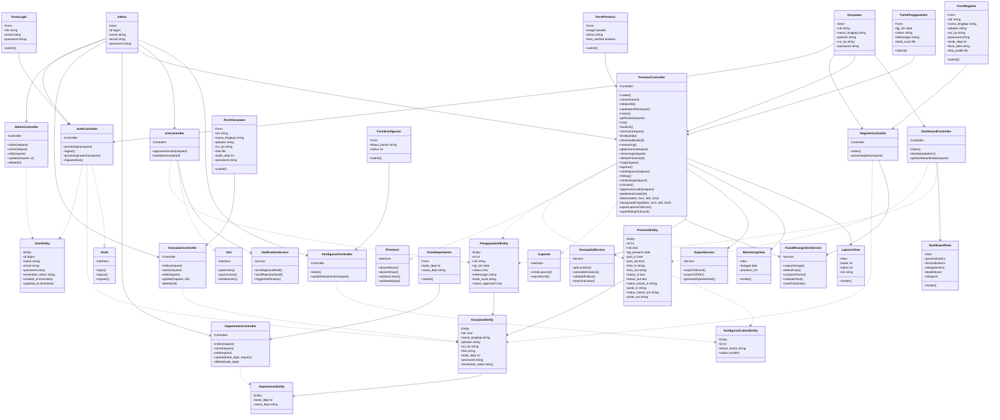

# Class Diagram E-Presensi

```mermaid
classDiagram
    %% ========== ACTORS ==========
    class Admin {
        -Actor-
        +id bigint
        +name string
        +email string
        +password string
    }

    class Karyawan {
        -Actor-
        +nik string
        +nama_lengkap string
        +jabatan string
        +no_hp string
        +password string
    }

    %% ========== ENTITIES ==========
    class UserEntity {
        -Entity-
        +id bigint
        +name string
        +email string
        +password string
        +remember_token string
        +created_at timestamp
        +updated_at timestamp
    }

    class KaryawanEntity {
        -Entity-
        +nik char
        +nama_lengkap string
        +jabatan string
        +no_hp string
        +foto string
        +kode_dept int
        +password string
        +remember_token string
    }

    class DepartemenEntity {
        -Entity-
        +kode_dept int
        +nama_dept string
    }

    class PresensiEntity {
        -Entity-
        +id int
        +nik char
        +tgl_presensi date
        +jam_in time
        +jam_out time
        +foto_in string
        +foto_out string
        +lokasi_in text
        +lokasi_out text
        +status_lokasi_in string
        +jarak_in string
        +status_lokasi_out string
        +jarak_out string
    }

    class PengajuanIzinEntity {
        -Entity-
        +id int
        +nik string
        +tgl_izin date
        +status char
        +keterangan string
        +bukti_surat string
        +status_approved char
    }

    class KonfigurasiLokasiEntity {
        -Entity-
        +id int
        +lokasi_kantor string
        +radius smallint
    }

    %% ========== CONTROLLERS ==========
    class AuthController {
        -Controller-
        +proseslogin(request)
        +logout()
        +prosesloginadmin(request)
        +logoutadmin()
    }

    class RegisterController {
        -Controller-
        +index()
        +prosesregister(request)
    }

    class DashboardController {
        -Controller-
        +index()
        +dashboardadmin()
        +getDashboardData(request)
    }

    class AdminController {
        -Controller-
        +index(request)
        +store(request)
        +edit(request)
        +update(request, id)
        +delete(id)
    }

    class KaryawanController {
        -Controller-
        +index(request)
        +store(request)
        +edit(request)
        +update(request, nik)
        +delete(nik)
    }

    class DepartemenController {
        -Controller-
        +index(request)
        +store(request)
        +edit(request)
        +update(kode_dept, request)
        +delete(kode_dept)
    }

    class PresensiController {
        -Controller-
        +create()
        +store(request)
        +editprofile()
        +updateprofile(request)
        +histori()
        +gethistori(request)
        +izin()
        +buatizin()
        +storeizin(request)
        +lihatbukti(id)
        +downloadbukti(id)
        +monitoring()
        +getpresensi(request)
        +showmap(request)
        +deletePresensi(id)
        +map(request)
        +laporan()
        +cetaklaporan(request)
        +Rekap()
        +cetakrekap(request)
        +izinsakit()
        +approveizinsakit(request)
        +batalkanizinsakit(id)
        -distance(lat1, lon1, lat2, lon2)
        -hitungJarakCepat(lat1, lon1, lat2, lon2)
        -exportLaporanToExcel()
        -exportRekapToExcel()
    }

    class IzinController {
        -Controller-
        +approveizinsakit(request)
        +batalkanizinsakit(id)
    }

    class KonfigurasiController {
        -Controller-
        +index()
        +updatelokasikantor(request)
    }

    %% ========== INTERFACES ==========
    class IAuth {
        -Interface-
        +login()*
        +logout()*
        +register()*
    }

    class IPresensi {
        -Interface-
        +absenMasuk()*
        +absenKeluar()*
        +validasiLokasi()*
        +validasiWajah()*
    }

    class IIzin {
        -Interface-
        +ajukanIzin()*
        +approveIzin()*
        +batalkanIzin()*
    }

    class ILaporan {
        -Interface-
        +cetakLaporan()*
        +exportExcel()*
    }

    %% ========== FORMS/VIEWS ==========
    class FormLogin {
        -Form-
        +nik string
        +email string
        +password string
        +submit()
    }

    class FormRegister {
        -Form-
        +nik string
        +nama_lengkap string
        +jabatan string
        +no_hp string
        +password string
        +kode_dept int
        +face_data string
        +foto_profile file
        +submit()
    }

    class FormPresensi {
        -Form-
        +image base64
        +lokasi string
        +face_verified boolean
        +submit()
    }

    class FormPengajuanIzin {
        -Form-
        +tgl_izin date
        +status string
        +keterangan string
        +bukti_surat file
        +submit()
    }

    class FormKaryawan {
        -Form-
        +nik string
        +nama_lengkap string
        +jabatan string
        +no_hp string
        +foto file
        +kode_dept int
        +password string
        +submit()
    }

    class FormDepartemen {
        -Form-
        +kode_dept int
        +nama_dept string
        +submit()
    }

    class FormKonfigurasi {
        -Form-
        +lokasi_kantor string
        +radius int
        +submit()
    }

    class DashboardView {
        -View-
        +presensihariini
        +histroribulanini
        +rekappresensi
        +leaderboard
        +rekapizin
        +render()
    }

    class MonitoringView {
        -View-
        +tanggal date
        +presensi_list
        +render()
    }

    class LaporanView {
        -View-
        +bulan int
        +tahun int
        +nik string
        +render()
    }

    %% ========== SERVICES ==========
    class FacialRecognitionService {
        -Service-
        +captureImage()
        +detectFace()
        +compareFaces()
        +validateFace()
        +saveFaceData()
    }

    class GeospatialService {
        -Service-
        +getLocation()
        +calculateDistance()
        +validateRadius()
        +checkInKantor()
    }

    class NotificationService {
        -Service-
        +sendApprovalNotif()
        +sendRejectionNotif()
        +triggerNotification()
    }

    class ExportService {
        -Service-
        +exportToExcel()
        +exportToPDF()
        +generateSpreadsheet()
    }

    %% ========== RELASI ACTOR TO CONTROLLER ==========
    Admin --> AuthController
    Admin --> AdminController
    Admin --> KaryawanController
    Admin --> DepartemenController
    Admin --> PresensiController
    Admin --> IzinController
    Admin --> KonfigurasiController

    Karyawan --> AuthController
    Karyawan --> RegisterController
    Karyawan --> PresensiController
    Karyawan --> DashboardController

    %% ========== RELASI CONTROLLER TO ENTITY ==========
    AuthController ..> UserEntity
    AuthController ..> KaryawanEntity
    RegisterController ..> KaryawanEntity
    AdminController ..> UserEntity
    KaryawanController ..> KaryawanEntity
    DepartemenController ..> DepartemenEntity
    PresensiController ..> PresensiEntity
    PresensiController ..> PengajuanIzinEntity
    IzinController ..> PengajuanIzinEntity
    KonfigurasiController ..> KonfigurasiLokasiEntity
    DashboardController ..> PresensiEntity
    DashboardController ..> PengajuanIzinEntity

    %% ========== RELASI CONTROLLER TO INTERFACE ==========
    AuthController ..|> IAuth
    PresensiController ..|> IPresensi
    IzinController ..|> IIzin
    PresensiController ..|> ILaporan

    %% ========== RELASI CONTROLLER TO SERVICE ==========
    PresensiController --> FacialRecognitionService
    PresensiController --> GeospatialService
    PresensiController --> ExportService
    IzinController --> NotificationService
    RegisterController --> FacialRecognitionService

    %% ========== RELASI FORM TO CONTROLLER ==========
    FormLogin --> AuthController
    FormRegister --> RegisterController
    FormPresensi --> PresensiController
    FormPengajuanIzin --> PresensiController
    FormKaryawan --> KaryawanController
    FormDepartemen --> DepartemenController
    FormKonfigurasi --> KonfigurasiController

    %% ========== RELASI CONTROLLER TO VIEW ==========
    DashboardController --> DashboardView
    PresensiController --> MonitoringView
    PresensiController --> LaporanView

    %% ========== RELASI ENTITY ==========
    KaryawanEntity --> DepartemenEntity
    PresensiEntity --> KaryawanEntity
    PengajuanIzinEntity --> KaryawanEntity
    PresensiEntity ..> KonfigurasiLokasiEntity
```